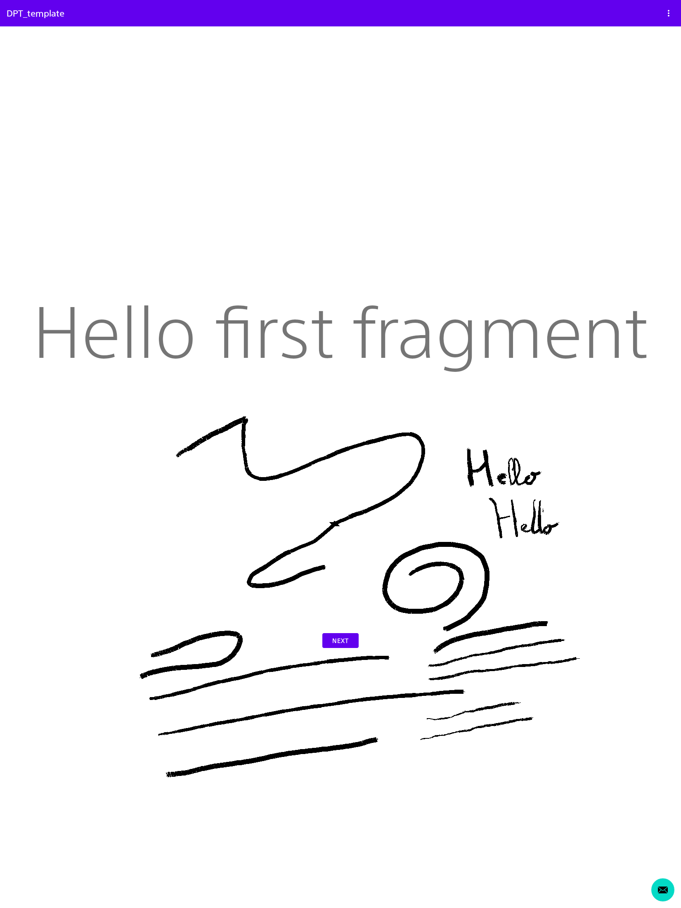

# DPT Template APK 
This is a stylus-enabled demo of a custom APK for the DPT-RP1.

## What this demontrates
* Stylus handwriting as fast as Sony
* Eraser feature, but not stroke-based (it clears a bitmap around the eraser circle
rather than detecting intersection between strokes and the eraser like Sony does)
* Stylus pressure, because yes it works

## Stylus handwriting
There are 3 ways to program handwriting for the Stylus on the DPT:

### The Android way
* Capture MotionEvent events
* Store the point/lines/whatever
* Invalidate the view, or a dirty rectangle
* Pray this doesn't redraw too late.

The performance are horrendous, this won't work

### The Software way
Sony has a special rewrite of the View class that can invalidate
a dirty rectangle in a preferential mode for E-Ink, a lot like what the Onyx lib does.

* Write a static cache to capture the Sony method at Runtime
* Run this method instead of View.Invalidate on your custom view, with a parameter
to indicate Direct Update 

```java
public class ViewOverride implements SonyOverride<View> {

    private static Method invalidateRect;

    static {
        try {
            invalidateRect = DrawableView.class.getMethod("invalidate", Rect.class, int.class);
            invalidateRect.setAccessible(true); // Small acceleration

        } catch (Exception ignored) {}
    }

    private final View view;

    public ViewOverride(final View view) {
        this.view = view;
    }

    public void invalidate(Rect rect, int updateMode) {
        invalidate(view, rect, updateMode);
    }

    public static void invalidate(View view, Rect rect, int updateMode) {
        try {
            invalidateRect.invoke(view, rect, updateMode);
        } catch (Exception ignored) { }
    }
}

// Then use it in a View inheritor:
@Override
public void invalidate(Rect dirty) {
    ViewOverride.invalidate(view, dirty, UPDATE_MODE_NOWAIT_NOCONVERT_DU_SP1_IGNORE);
}
```

This works well, but there's a 200 to 500ms delay, compared to the official app,
which is interestingly A LOT like all the early critics of the device said. Sony made an update around
2018, to "make it 30% faster"

### The Hardware way
It turns out, there's a special .so library in /lib/libSystemUtil.so, which can draw a fast squiggle
on the framebuffer, and that... makes it 30% faster. We can now store/draw to a bitmap slowly while 
pre-showing the squiggle (it's around 20px long ?) as a temporary preview.

```java
public class SystemUtil {

    private static SystemUtil.EpdUtil epdUtil;
    private static final SystemUtil systemUtil;

    static {
        System.loadLibrary("SystemUtil");
        systemUtil = new SystemUtil();
    }

    private SystemUtil() {
    }

    public native int getScreenShot(byte[] content);

    public native int nativeAddDhwArea(int left, int top, int right, int bottom, int penWidth, boolean portraitOrientation);

    public native int nativeChangeDhwStrokeWidth(int widthParam1, int widthParam2);

    public native boolean nativeGetDhwState();

    public native int nativeRemoveDhwArea(int index);

    public native void nativeSetDhwState(boolean enabled);

    public native int nativeWriteWaveform(byte[] waveform);

    public native int setShutdownScreenFlag(boolean enabled);

    public native int setShutdownScreenImage(byte[] image);

    public native int setStandbyScreenImage(byte[] image);
}

// Then use it during motion detection:
public void initView() {
        systemUtil.nativeAddDhwArea(
                0,
                0,
                view.getWidth(),
                view.getHeight(),
                strokeWidth,
                0
        );
}

public boolean onTouchEvent(MotionEvent event) {
    int action = event.getActionMasked();

    switch(action) {
        case MotionEvent.ACTION_DOWN:
            systemUtil.nativeSetDhwState(true);
            // ...
            break;
        case MotionEvent.ACTION_MOVE:
            // ...
            break;
        case MotionEvent.ACTION_UP:
        case MotionEvent.ACTION_CANCEL:
            // ...
            systemUtil.nativeSetDhwState(false);
            break;
    }
}
```

## Stylus pressure handling
It turns out that the device is able to sense pressure like most of its competition. 
Looking for maths/geometry geniuses who can find a less naive way to make it look and animate
nicely, I don't care too much for it myself. Here is what the app looks like with pressure handling:



```java
public boolean onTouchEvent(MotionEvent event) {
    float pressure = event.getPressure();
    // We renormalize the pressure: 0.5 is "normal"
    float multiplier = pressure / 0.5f;

    this.currentWidth = baseWidth * multiplier;
    if (this.currentWidth < 1) this.currentWidth = 1;
    strikeDelegate.getStrokePaint().setStrokeWidth(currentWidth);

    return strikeDelegate.onTouchEvent(event);
}
```

## TODO:
* Make pressure animate
* See if can draw the eraser circle fast enough
* Store / retrieve context-based anotation
* Make the eraser stroke-based like Sony
* Store / Retrieve strokes or at least the bitmap with event listeners
so that clients can retrieve them